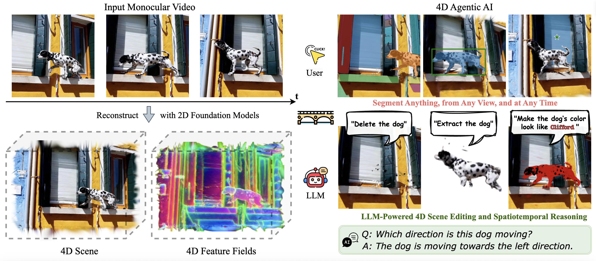

# Feature4X: Bridging Any Monocular Video to 4D Agentic AI with Versatile Gaussian Feature Fields
Shijie Zhou*, <a href="https://rhfeiyang.github.io/" target="_blank">Hui Ren*</a>, Yijia Weng, Shuwang Zhang, Zhen Wang, Dejia Xu, Zhiwen Fan, Suya You, Zhangyang Wang, Leonidas Guibas, Achuta Kadambi (* indicates equal contribution)<br>
| [Website](https://feature4x.github.io/) | [Paper](https://arxiv.org/pdf/2503.20776) | [Video](https://www.youtube.com/watch?v=-LQsnYFkciw) | <br>



Abstract: *Recent advancements in 2D and multimodal models have achieved remarkable success by leveraging large-scale training on extensive datasets. However, extending these achievements to enable free-form interactions and high-level semantic operations with complex 3D/4D scenes remains challenging. This difficulty stems from the limited availability of large-scale, annotated 3D/4D or multi-view datasets, which are crucial for generalizable vision and language tasks such as open-vocabulary and prompt-based segmentation, language-guided editing, and visual question answering (VQA). In this paper, we introduce Feature4X, a universal framework designed to extend any functionality from 2D vision foundation model into the 4D realm, using only monocular video input, which is widely available from user-generated content. The "X" in Feature4X represents its versatility, enabling any task through adaptable, model-conditioned 4D feature field distillation. At the core of our framework is a dynamic optimization strategy that unifies multiple model capabilities into a single representation. Additionally, to the best of our knowledge, Feature4X is the first method to distill and lift the features of video foundation models (e.g., SAM2, InternVideo2) into an explicit 4D feature field using Gaussian Splatting. Our experiments showcase novel view segment anything, geometric and appearance scene editing, and free-form VQA across all time steps, empowered by LLMs in feedback loops. These advancements broaden the scope of agentic AI applications by providing a foundation for scalable, contextually and spatiotemporally aware systems capable of immersive dynamic 4D scene interaction.*

<section class="section" id="BibTeX">
  <div class="container is-max-desktop content">
    <h2 class="title">Citation</h2>
    <p>
      If you find our work useful for your research, please consider citing our paper and giving our repository a star ⭐ on GitHub. Your support helps us continue to develop and share our work with the community!
    </p>
    <pre><code>@inproceedings{zhou2025feature4x,
  title={Feature4X: Bridging Any Monocular Video to 4D Agentic AI with Versatile Gaussian Feature Fields},
  author={Zhou, Shijie and Ren, Hui and Weng, Yijia and Zhang, Shuwang and Wang, Zhen and Xu, Dejia and Fan, Zhiwen and You, Suya and Wang, Zhangyang and Guibas, Leonidas and others},
  booktitle={Proceedings of the Computer Vision and Pattern Recognition Conference},
  pages={14179--14190},
  year={2025}
}
</code></pre>
  </div>
</section>

## Environment Setup
We used torch 2.4.1 with CUDA 12.4:
```bash
# Set up conda environment
bash setup_env.sh
conda activate feature4x

# Download model weights for preprocessing and feature fields
bash setup_weights.sh

# Make sure you're in the project root directory and conda environment is activated
conda activate feature4x

# Input your video and distill all features (SAM2, CLIP-Lseg, InternVideo2) and reconstruct the 4D feature fields
bash setup_feature_fields.sh
```

## Usage

### 🔧 Environment Variables Setup (One-time)
Before using Feature4X, set up your API keys to avoid entering them repeatedly:

```bash
export OPENAI_API_KEY="your_openai_api_key"      # For editing agent
export HF_TOKEN="your_huggingface_token"         # For chat agent
```

**Get your tokens:**
- OpenAI API key: https://platform.openai.com/account/api-keys
- Hugging Face token: https://huggingface.co/settings/tokens

### 🌟 Interactive Interface (Recommended)
The easiest way to use Feature4X is through our unified interactive interface:

```bash
conda activate feature4x
python feature4x_interactive.py
```

This provides a user-friendly menu system with **simplified data selection**:

1. **Choose Dataset** (e.g., "car")
2. **Choose View** (e.g., "20_round_moving" - local view "CameraID_CameraTrajectory_SceneDynamics", "3D_moving" - global view)
3. **Choose Action** (segment, understand, edit, or chat)

**Available Functionalities:**
- 🎯 **SAM2 Segmentation** - Interactive segmentation with 4D feature fields
- 🧠 **Semantic Understanding** - Language-guided semantic segmentation  
- ✏️ **Language-guided Editing** - Natural language scene editing with agent (GPT-4o)
- 💬 **4D Visual Question Answering (VQA)** - Interactive chat with 4D scenes

### Manual Command Line Usage (Optional)

#### SAM2 Segmentation
Interactive segmentation using SAM2 with 4D feature fields:

```bash
# Interactive mode with produced reference frame
python sam2/sam2_segmentation.py --rendered_results_path output/car/final_viz/20_round_moving/rendered_results.pth
```

- ✅ Interactive coordinate selection on images
- ✅ Support for point and/or bounding box input
- ✅ Multiple segmentation modes
- ✅ Automatic path construction from dataset + view

#### Semantic Understanding
Language-guided semantic segmentation with CLIP-LSeg:

```bash
python lseg_encoder/lseg_inference.py --rendered_results_path output/car/final_viz/20_round_moving/rendered_results.pth --labels car,building,sky,road --save_features
```
- ✅ Optional custom label specification
- ✅ Optional feature saving
- ✅ Automatic path construction

#### Language-guided Editing
Advanced scene editing with natural language commands powered by GPT-4o (OpenAI API Key required):

```bash
# With environment variable OPENAI_API_KEY set:
python agent_editing.py --config ./configs/wild/davis.yaml --root output/car --user_prompt 'Make the color of the car look like Bumblebee' --num_attempt 10 --threshold_lb 0.85 --threshold_ub 0.95

python agent_editing.py --config ./configs/wild/davis.yaml --root output/car --user_prompt 'Delete the car' --num_attempt 10 --threshold_lb 0.85 --threshold_ub 0.95

python agent_editing.py --config ./configs/wild/davis.yaml --root output/car --user_prompt 'Extract the car' --num_attempt 10 --threshold_lb 0.85 --threshold_ub 0.95
```

- ✅ Natural language editing commands
- ✅ Automatic threshold tuning (10 attempts by default)
- ✅ Configurable search parameters
- ✅ Environment variable support for API keys
- ✅ Interactive prompting if no environment variable

#### 4D Visual Question Answering (VQA)
Have natural conversations with your 4D scenes:

**Interactive Chat Mode:**
```bash
# Start interactive conversation
python agent_chat.py --data_name bear --rendered_view 41_fixed_moving --interactive

# Example conversation:
# 🤖 Assistant: Hello! I'm ready to answer questions about your 4D scene.
# 👤 You: What do you see in the scene?
# 🤖 Assistant: I can see a bear moving through the environment...
# 👤 You: What color is the bear?
# 🤖 Assistant: The bear appears to be brown...
# 👤 You: quit
```

**Single Question Mode:**
```bash
# Ask one question and exit
python agent_chat.py --data_name bear --rendered_view 3D_moving --question "What do you see?"
```
- 💬 **Multi-turn Conversations**: Ask follow-up questions with context
- 🧠 **Chat History**: Previous questions provide context for new ones
- 🎛️ **Chat Commands**: 
  - Type questions naturally
  - `clear` - Reset chat history
  - `quit`, `exit`, `bye` - End conversation
  - `Ctrl+C` - Force exit
- ✅ **Simplified Arguments**: Use `--data_name` + `--rendered_view` instead of complex paths
- 🔐 **Environment Variable Support**: Set `HF_TOKEN` once, use everywhere

**Requirements:**
- Hugging Face access token for InternVideo2-Chat-8B
- Get your token at: https://huggingface.co/settings/tokens
- Set via environment variable: `export HF_TOKEN=your_token_here`

## Acknowledgements

We sincerely thank the authors and contributors of the following open-source projects, which were instrumental in the development of Feature4X:

- **[MoSca](https://github.com/csbhr/MoSca)** - Dynamic Scene Reconstruction
- **[Feature 3DGS](https://github.com/ShijieZhou-UCLA/feature-3dgs)** - Feature Splatting for Language-Guided Scene Understanding and Manipulation
- **[SAM2](https://github.com/facebookresearch/segment-anything-2)** - Segment Anything in Images and Videos
- **[CLIP-LSeg](https://github.com/isl-org/lang-seg)** - Language-driven Semantic Segmentation
- **[InternVideo2](https://github.com/OpenGVLab/InternVideo/tree/main/InternVideo2)** - Video Foundation Models for Multimodal Understanding

Our work builds upon these excellent contributions to the computer vision and AI research community. We are grateful for their commitment to open science and making their code publicly available.


