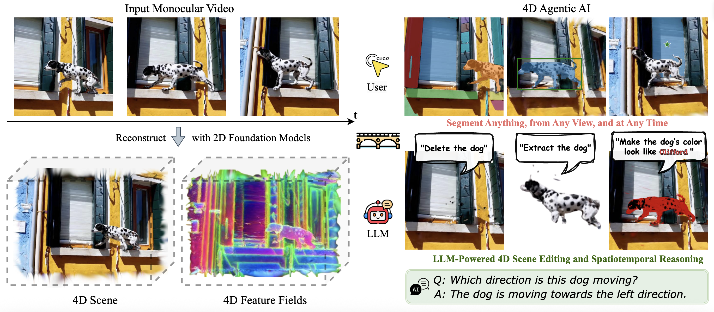

# Feature4X: Bridging Any Monocular Video to 4D Agentic AI with Versatile Gaussian Feature Fields
Shijie Zhou*, Hui Ren*, Yijia Weng, Shuwang Zhang, Zhen Wang, Dejia Xu, Zhiwen Fan, Suya You, Zhangyang Wang, Leonidas Guibas, Achuta Kadambi (* indicates equal contribution) 
| [Website](https://feature4x.github.io/) | [Paper](https://arxiv.org/pdf/2503.20776) | [Video](https://www.youtube.com/watch?v=-LQsnYFkciw) |  

Abstract: *Recent advancements in 2D and multimodal models have achieved remarkable success by leveraging large-scale training on extensive datasets. However, extending these achievements to enable free-form interactions and high-level semantic operations with complex 3D/4D scenes remains challenging. This difficulty stems from the limited availability of large-scale, annotated 3D/4D or multi-view datasets, which are crucial for generalizable vision and language tasks such as open-vocabulary and prompt-based segmentation, language-guided editing, and visual question answering (VQA). In this paper, we introduce Feature4X, a universal framework designed to extend any functionality from 2D vision foundation model into the 4D realm, using only monocular video input, which is widely available from user-generated content. The "X" in Feature4X represents its versatility, enabling any task through adaptable, model-conditioned 4D feature field distillation. At the core of our framework is a dynamic optimization strategy that unifies multiple model capabilities into a single representation. Additionally, to the best of our knowledge, Feature4X is the first method to distill and lift the features of video foundation models (e.g., SAM2, InternVideo2) into an explicit 4D feature field using Gaussian Splatting. Our experiments showcase novel view segment anything, geometric and appearance scene editing, and free-form VQA across all time steps, empowered by LLMs in feedback loops. These advancements broaden the scope of agentic AI applications by providing a foundation for scalable, contextually and spatiotemporally aware systems capable of immersive dynamic 4D scene interaction.*

<section class="section" id="BibTeX">
  

    <h2 class="title">BibTeX</h2>
    <pre><code>@inproceedings{zhou2025feature4x,
  title={Feature4X: Bridging Any Monocular Video to 4D Agentic AI with Versatile Gaussian Feature Fields},
  author={Zhou, Shijie and Ren, Hui and Weng, Yijia and Zhang, Shuwang and Wang, Zhen and Xu, Dejia and Fan, Zhiwen and You, Suya and Wang, Zhangyang and Guibas, Leonidas and others},
  booktitle={Proceedings of the Computer Vision and Pattern Recognition Conference},
  pages={14179--14190},
  year={2025}
}
</code></pre>
  

</section>

# Update - 06/11/2025 

We’re wrapping up the final stages of code cleanup and plan to open-source the project by late June—stay tuned!

First author [Shijie Zhou](https://shijiezhou-ucla.github.io/) will be presenting this work at CVPR in Nashville (June 11–15) and would love to connect if you’re curious to learn more :)

Come say hi at our poster session in Exhibit Hall D, Poster #338, on Saturday, June 14, from 8:30–10:30 AM!